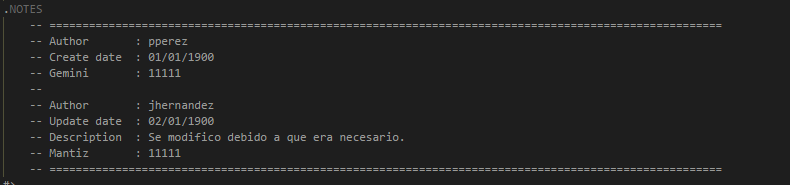

# ProcessaProgramTemplate
Plantilla que sera utilizada para los programas de PowerShell creados por Processa.

## Uso

1. Instalar el módulo Plaster

```powershell
Install-Module Plaster
```

2. Importar el módulo Plaster

```powershell
Import-Module Plaster
```

3. Descargar y descomprimir la plantilla desde la sección de [Releases](../../releases)

4. Crear un proyecto utilizando la plantilla

```powershell
# Ruta de la carpeta donde está el archivo PlasterManifest.xml
$MyFolderTemplate = 'C:\Plaster\Templates\Processa\ProcessaProgramTemplate'

# Ruta de la carpeta donde se creará el programa 
$MyFolderDestination = 'C:\Temp\Program-ClienteLoadMonetary'

Invoke-Plaster -TemplatePath $MyFolderTemplate -DestinationPath $MyFolderDestination
```

--------------
## Nombre De Programas

Se decidio seguir un estandar para los nombres de los programas asi hacer que sean mas faciles de identificar:
* Program-\<Cliente>\<Nombre Programa>
El nombre del programa deberia ser descriptivo a su funcionamiento 
#### Ejemplo : Program-MyCustomerLoadMonetary

--------------
## Actualizar Una Funcion .ps1

Cuando se realice una modificacion a un programa existente y se modifique archivos de funciones se debe agregar una nota de actualizacion:

<h2 align="center"></h2>
--------------
## Actualizar Un Script SQL 

Cuando se realice una modificacion a un programa existente y se modifique archivos de scripts sql se debe agregar una nota de actualizacion:

<h2 align="center"></h2>

[¿Qué es Plaster?](https://github.com/PowerShell/Plaster)

[¿Dónde está la plantilla?](https://github.com/RD-Processa/ProcessaProgramTemplate/releases)
